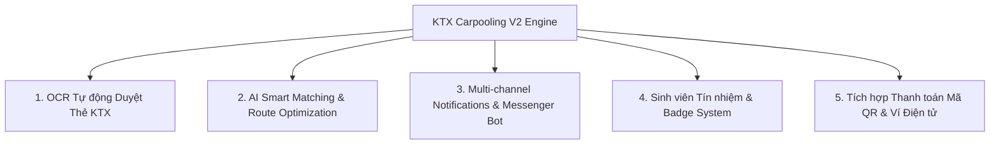
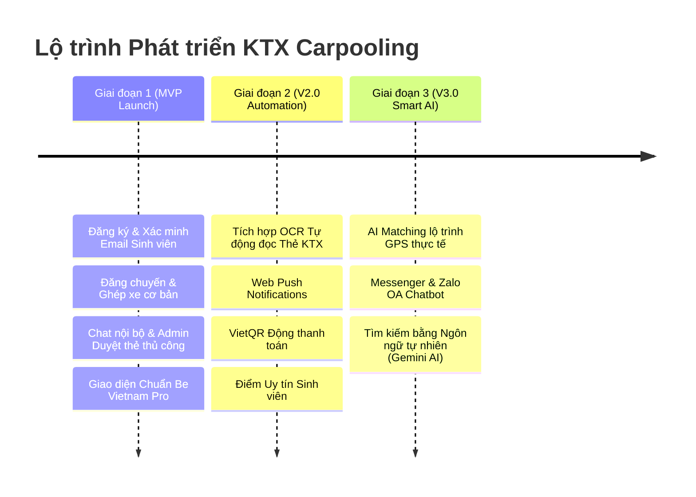

# KẾ HOẠCH NÂNG CẤP & PHÁT TRIỂN NĂNG LỰC (PHASE 2 & 3 — FUTURE ROADMAP V2)
## Nền tảng Ghép xe Máy Sinh viên KTX ĐHQG-HCM (KTX Carpooling)

> **Mục tiêu**: Định hướng mở rộng, tự động hóa toàn diện quy trình xác minh sinh viên bằng AI/OCR, tối ưu thuật toán ghép chuyến thông minh, đẩy mạnh thông báo thời gian thực và tích hợp đa nền tảng.

---

## 1. TỔNG QUAN CÁC TRỤ CỘT NÂNG CẤP (V2 PILLARS)

---

## 2. PHÂN TÍCH CHI TIẾT CÁC HẠNG MỤC NÂNG CẤP

### 2.1 OCR Tự động Nhận dạng & Kiểm tra Thẻ KTX (OCR Verification Engine)
- **Công nghệ**: Tesseract.js / Google Cloud Vision API / AWS Rekognition.
- **Quy trình xử lý**:
  1. Sinh viên tải ảnh thẻ KTX lên hệ thống.
  2. OCR Engine tự động quét và trích xuất các trường thông tin:
     - **Mã số sinh viên (MSSV)**
     - **Họ và tên**
     - **Tên trường Đại học** (HCMUS, HCMUT, UIT, USSH, IU, UEL,...)
     - **Khu KTX & Số phòng/Tòa**
  3. Tự động đối chiếu dữ liệu trích xuất với thông tin khai báo.
  4. Cảnh báo hình ảnh mờ, chói sáng, ảnh chụp lại màn hình hoặc thẻ không hợp lệ.
  5. Tự động chuyển trạng thái `VERIFIED` nếu độ tin cậy OCR $\ge 95\%$ (giúp giảm $90\%$ khối lượng công việc duyệt tay cho Admin).

### 2.2 Thuật toán AI Ghép chuyến & Gợi ý Lộ trình Thông minh (AI Smart Matching Engine)
- **Công nghệ**: Google Gemini API, OSRM / Google Maps Distance Matrix, Vector Similarity Search.
- **Tính năng nâng cao**:
  - Ghép chuyến theo **lộ trình di chuyển thực tế (Polyline Route Matching)** chứ không chỉ theo điểm xuất phát/điểm đến cố định.
  - Gợi ý tài xế đón sinh viên trên cùng tuyến đường (ví dụ: Tài xế đi từ Khu B KTX ➔ HCMUS CS1 Quận 5 có thể ghé đón khách tại tuyến đường đại lộ Võ Nguyên Giáp / Phạm Văn Đồng).
  - Phân tích ngữ cảnh tự nhiên (Natural Language Parsing) cho phép tìm kiếm chuyến bằng câu lệnh văn bản hoặc giọng nói (ví dụ: *"Tìm xe đi Bách Khoa sáng mai lúc 7h30"*).

### 2.3 Tích hợp Thông báo & Facebook Messenger Chatbot (Multi-Channel Integration)
- **Web Push Notifications**: Gửi thông báo đẩy tức thì tới điện thoại/máy tính khi:
  - Có yêu cầu ghép xe mới từ hành khách.
  - Tài xế duyệt / từ chối yêu cầu.
  - Có tin nhắn mới trong phòng chat.
- **Facebook Messenger & Zalo OA Bot**:
  - Nhận thông báo chuyến đi qua Messenger/Zalo.
  - Cho phép tài xế bấm nút "Chấp nhận" hoặc "Từ chối" trực tiếp ngay trong ứng dụng Messenger mà không cần mở trình duyệt.

### 2.4 Điểm Uy tín & Hệ thống Huy hiệu Sinh viên (Reputation & Badge System)
- **Bảng điểm Tín nhiệm (Trust Score)**:
  - Tích điểm dựa trên số chuyến đi thành công, tỷ lệ đúng giờ, điểm đánh giá trung bình từ sinh viên khác.
  - Trừ điểm phạt nếu hủy chuyến sát giờ đón hoặc vi phạm quy định an toàn.
- **Huy hiệu Vinh danh (Badges)**:
  - 🥇 *Tài xế Vàng KTX* (Đã chở thành công > 50 chuyến).
  - ⚡ *Tài xế Đúng giờ* (Tỷ lệ đón đúng giờ > 98%).
  - 🛡️ *Sinh viên Gương mẫu* (Đã xác minh đầy đủ thẻ KTX & email trường).

### 2.5 Tích hợp Thanh toán Điện tử & Mã QR (E-payment & QR Code Integration)
- **Mã QR VietQR Động**: Tự động tạo mã QR VietQR chuyển khoản ngân hàng có sẵn số tiền đóng góp nhiên liệu và nội dung mã chuyến đi.
- **Tích hợp Ví điện tử**: Hỗ trợ MoMo / ZaloPay / ShopeePay để sinh viên quyết toán nhanh chi phí đi lại.

---

## 3. LỘ TRÌNH TRIỂN KHAI THEO GIAI ĐOẠN (RELEASE ROADMAP)

---

## 4. BẢNG TỔNG HỢP NĂNG LỰC: MVP VS VERSION 2

| Hạng mục | Bản MVP (Hiện tại) | Bản V2 (Nâng cấp) |
|---|---|---|
| **Xác minh Thẻ KTX** | Admin xem ảnh & Duyệt thủ công | **OCR AI tự động nhận dạng MSSV & Tự động duyệt** |
| **Ghép chuyến** | Lọc theo Cơ sở Trường học / Điểm đến | **AI Matching theo Lộ trình GPS / Tuyến đường đi thực tế** |
| **Thông báo** | Kiểm tra trên Giao diện Web | **Web Push Notifications & Messenger / Zalo Alert** |
| **Thanh toán** | Sinh viên tự thỏa thuận / Tiền mặt | **Tự động sinh mã VietQR Động / Ví MoMo** |
| **Uy tín Sinh viên** | Đánh giá Sao & Nhận xét cơ bản | **Hệ thống Điểm Tín nhiệm, Huy hiệu & Xếp hạng** |
| **Tìm kiếm AI** | Lọc theo Form Tìm kiếm | **AI Gemini Tìm kiếm bằng Câu lệnh Ngôn ngữ Tự nhiên** |
