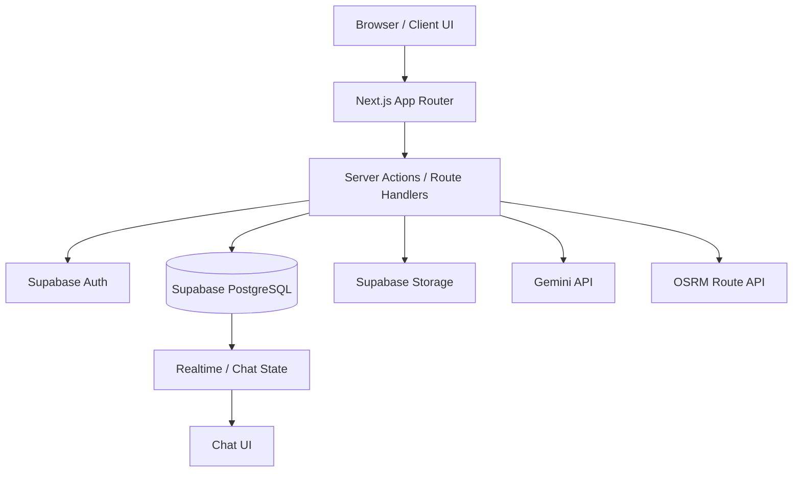

# Báo Cáo Kỹ thuật Dự án — KTX Carpooling

Dịch vụ kết nối đi chung xe máy cho sinh viên Ký túc xá Đại học Quốc gia TP. Hồ Chí Minh (ĐHQG-HCM) Khu A & Khu B.

---

## 1. Tổng quan dự án

KTX Carpooling là hệ thống ghép chuyến xe máy cho sinh viên nội trú ở Khu A và Khu B, phục vụ các tuyến đi học tới các trường đại học trong hệ thống ĐHQG-HCM và các trường lân cận. Dự án tập trung vào 4 giá trị cốt lõi:

- tiết kiệm chi phí
- tiết kiệm thời gian
- tăng độ an toàn và tin cậy
- tạo môi trường đi chung yêu cầu xác minh rõ ràng

Hệ thống hỗ trợ các tình huống đi học theo tuyến, đồng thời cho phép sinh viên đăng chuyến, tìm chuyến, gửi yêu cầu, chat và đánh giá sau khi hoàn thành chuyến.

---

## 2. Đối tượng người dùng

### 2.1 Tài xế
- Có xe máy và muốn chở cùng tuyến
- Có thể đăng chuyến đi
- Chấp nhận hoặc từ chối yêu cầu của hành khách
- Quản lý trạng thái chuyến đi và mở phòng chat khi đã được chấp nhận

### 2.2 Hành khách
- Cần đi cùng với người khác
- Tìm chuyến theo trường, ngày và giờ
- Gửi lời nhắn và yêu cầu đi cùng
- Theo dõi trạng thái yêu cầu

### 2.3 Quản trị viên
- Duyệt tài khoản sinh viên và hồ sơ thẻ KTX
- Xác minh tính hợp lệ của thông tin sinh viên
- Theo dõi các trường hợp sai lệch, báo cáo hoặc từ chối hồ sơ

---

## 3. Kiến trúc hệ thống

### 3.1 Stack công nghệ
- Frontend: Next.js 16 + React 19 + TypeScript
- Styling: Tailwind CSS v4
- Backend/Auth/Storage: Supabase
- Database: PostgreSQL on Supabase
- AI parsing: Google Gemini API
- Routing + distance: OpenStreetMap OSRM
- Messaging: Facebook Messenger webhook skeleton

### 3.2 Kiến trúc tổng quan



### 3.3 Lớp dữ liệu và mô hình

- Profile: thông tin người dùng và trạng thái xác minh
- Locations: point of interest và trường/học khu
- Routes: tuyến đường KTX → trường, có distance, duration, provider
- Trips: chuyến đi được tạo bởi tài xế
- Trip requests: yêu cầu ghép xe từ hành khách
- Messages: tin nhắn trong phòng chat
- Ratings: đánh giá sau chuyến
- Notifications, reports, admin actions: mở rộng và quản trị

---

## 4. Nghiệp vụ chính của hệ thống

### 4.1 Tạo tài khoản và xác minh sinh viên
Quy trình đăng ký bước đầu gồm:
- email học thuật hợp lệ
- thông tin cá nhân
- khu KTX và tòa nhà
- vai trò người dùng
- OTP 6 chữ số

Sau đó sinh viên cần upload thẻ KTX để xác minh danh tính. Trạng thái có thể là:
- PENDING
- VERIFIED
- REJECTED
- NEED_REVIEW (nếu schema document có)

### 4.2 Tạo chuyến đi
Tài xế tạo chuyến với các trường sau:
- ngày đi
- giờ đón
- nơi đón
- điểm đến
- trường và campus
- số ghế trống
- khoảng cách và giá đề xuất
- phương thức thanh toán

Mỗi chuyến lưu trạng thái như:
- OPEN
- REQUESTED
- ACCEPTED
- IN_PROGRESS
- COMPLETED
- CANCELLED
- EXPIRED
- REPORTED

### 4.3 Tìm chuyến và ghép chuyến
Hành khách có thể:
- tìm theo ngày
- tìm theo trường và giờ
- xem các trip phù hợp
- nhận match score theo logic ranking

Logic ghép chuyến dựa trên:
- cùng ngày
- cùng trường
- cùng campus
- chênh lệch giờ đón <= 5 phút
- mặt bằng rating / uy tín tài xế

### 4.4 Gửi yêu cầu và chấp nhận
- Hành khách gửi yêu cầu với lời nhắn
- Tài xế có thể chấp nhận / từ chối
- Khi chấp nhận, hệ thống tạo điều kiện cho chat giữa hai bên

### 4.5 Chat và đánh giá
- Sau khi chấp nhận, room chat được mở
- Người dùng có thể trao đổi về điểm hẹn, thời gian, phương tiện
- Sau khi hoàn tất chuyến, đánh giá có thể được gửi

---

## 5. Thuật toán matching

### 5.1 Quy tắc lọc cơ bản
Trong `src/lib/matching.ts`, hệ thống thực hiện lọc theo các tiêu chí:

- cùng ngày
- chênh lệch giờ đón ≤ 5 phút
- trip còn ghế
- trạng thái `OPEN`
- cùng trường đến

### 5.2 Tính điểm khớp
Điểm được phân bổ theo cấu trúc:

- cùng trường: +40
- cùng campus: +25
- lệch giờ 0 phút: +25
- lệch giờ 1–2 phút: +20
- lệch giờ 3–5 phút: +10
- rating tài xế >= 4.5: +10

Điểm này dùng để xếp hạng trip phù hợp. Đây là cơ chế quan trọng nhất để người dùng tìm được chuyến gần nhất với nhu cầu của mình.

---

## 6. Thuật toán định giá và khoảng cách

### 6.1 Khoảng cách
Dự án ưu tiên tính khoảng cách với OSRM thông qua route API. Nếu API lỗi hoặc không có dữ liệu, hệ thống fallback về ma trận khoảng cách chuẩn hóa.

### 6.2 Công thức giá gợi ý

$$
\text{suggested price} = \max(\text{distance\_km} \times 2000, 5000)
$$

Trong đó:
- 2000 VND/km
- giá tối thiểu 5000 VND
- được dùng như cơ sở tạm tính cho việc chia sẻ chi phí

### 6.3 Dữ liệu chuẩn hóa
Trong các file CSV chuẩn hóa, hệ thống lưu:
- location list
- route list
- route_code
- start_area_code / destination_area_code
- distance_meters
- duration_seconds
- provider
- status

Điều này giúp mô hình dự án có dữ liệu chuẩn cho khoảng cách và định tuyến hỗ trợ AI / matching logic.

---

## 7. AI trong dự án

### 7.1 Mục tiêu
AI được dùng để chuyển câu tìm kiếm tự nhiên của sinh viên sang cấu trúc dữ liệu chuẩn, ví dụ:

```json
{
  "date": "2026-09-21",
  "pickup_building": "B2",
  "pickup_time": "06:30",
  "destination_school": "HCMUS",
  "class_period": 1
}
```

### 7.2 Cách hoạt động
- Gửi prompt cho Gemini API
- Parse text từ câu tiếng Việt
- Trích xuất thông tin cần thiết cho tìm trip

### 7.3 Fallback khi AI lỗi
Nếu Gemini không phản hồi hoặc hết quota, hệ thống dùng regex parser dựa trên từ khóa sinh viên như:
- ngày mai / hôm nay / 6h30 / 7 rưỡi / HCMUS / B2

Điều này giúp hệ thống không mất khả năng tìm kiếm khi AI bị lỗi.

---

## 8. Dữ liệu địa lý chuẩn hóa

### 8.1 Khu KTX
- KTX Khu A
- KTX Khu B

### 8.2 Các trường đại học trong dataset
- HCMUS
- HCMUT
- UIT
- USSH
- IU
- UEL

Bên cạnh đó, các tài liệu và CSV mở rộng còn có nhiều trường thuộc danh sách hỗ trợ, chẳng hạn:
- UEH
- UEF
- VGU
- VLU
- FPT
- HUTECH
- UAH
- NTTU
- TDTU
- và các trường khác trong hệ thống ĐHQG-HCM và vùng lân cận

### 8.3 Tọa độ và đường đi
Mỗi điểm được chuẩn hóa với các thuộc tính:
- name
- institution_type
- campus_name
- address
- latitude
- longitude
- area_code
- source_url
- verification_status

Các tuyến đường được chuẩn hóa theo mô hình:
- start_area_code
- destination_area_code
- travel_mode
- distance_meters
- duration_seconds
- provider
- route_geometry

---

## 9. Dữ liệu Supabase hiện có

Tài liệu `CautrucSupabase.txt` và các ghi chú trong repo cho thấy mô hình dữ liệu thực tế đang kỳ vọng gồm các bảng chính sau:

- profiles
- verified_student_records
- locations
- routes
- pricing_rules
- route_prices
- vehicles
- document_verifications
- trips
- trip_requests
- cancellations
- ratings
- return_trip_requests
- contact_logs
- notifications
- trip_reports
- admin_actions

Cấu trúc này lớn hơn mô hình nền tảng ban đầu và phù hợp với mục tiêu mở rộng dài hạn, bao gồm cả xác minh giấy tờ, vehicle, pricing và reporting.

---

## 10. Mô hình dữ liệu phân cấp

### 10.1 Bảng profiles
Lưu trữ thông tin cá nhân, vai trò và trạng thái người dùng.

Các mục quan trọng:
- full_name
- student_id
- email
- phone
- university
- dorm_area
- dorm_building
- average_rating
- completed_trip_count
- cancelled_trip_count
- account_status
- verification_status

### 10.2 Bảng locations
Lưu dữ liệu điểm đi và điểm đến chuẩn hóa.

### 10.3 Bảng routes
Lưu tuyến đường tính sẵn giữa start/destination, thường dùng cho route matching và pricing.

### 10.4 Bảng trips
Lưu chuyến đi đã được tạo, với snapshot về khoảng cách, giá, thời gian, trạng thái và người lái.

### 10.5 Bảng trip_requests
Lưu yêu cầu đi cùng của hành khách từ trip tương ứng.

### 10.6 Bảng ratings
Lưu đánh giá sử dụng sau khi chuyến đi hoàn tất.

---

## 11. Ràng buộc và vấn đề cần lưu ý

### 11.1 Mismatch giữa docs và DB thật
Nhiều tài liệu trong repo mô tả theo kỳ vọng, nhưng schema thực sự trên Supabase chưa được xác minh đầy đủ. Một số trường hợp cần chú ý:

- tên cột `date` vs `trip_date`
- enum case dùng chữ hoa vs chữ thường
- `status` vs `account_status`
- `profiles` và `users`

### 11.2 Authorization và Security
Những file `.ai` đã chỉ rõ các vấn đề về:
- missing authorization trong server actions
- admin không được kiểm tra role
- route api upload thẻ KTX gọi sai bảng
- callback auth rỗng

Đây là các điểm cần ưu tiên trước khi production.

### 11.3 Data completeness
Các CSV và file dữ liệu được cung cấp là nguồn dữ liệu rất hữu ích cho AI agent trong việc hiểu domain. Nếu database thực không được nối, các file CSV này cần được đưa vào quy trình seed hoặc import dữ liệu chuẩn.

---

## 12. Kết luận chuyên môn

Dự án KTX Carpooling là dự án có phạm vi nghiệp vụ rõ ràng, cấu hình kỹ thuật hợp lý và dữ liệu vùng Đông Nam Á / ĐHQG-HCM khá đầy đủ. Nếu được tổ chức tốt, dự án khả năng trở thành một nền tảng carpooling thực sự cho sinh viên nội trú với mức độ đáng tin cậy cao.

Tuy nhiên, để thành công trong giai đoạn thực tế, cần ưu tiên:
- chuẩn hóa schema thật giữa docs và database
- kiểm tra authorization chặt chẽ
- hoàn thiện auth callback
- đảm bảo migrations và seed data có thể tái tạo được
- liên tục cập nhật data source từ CSV / route dataset

Đây chính là nền tảng để AI agent hoặc team phát triển nhận thức chính xác về dự án trong quá trình vận hành và phát triển tiếp theo.
