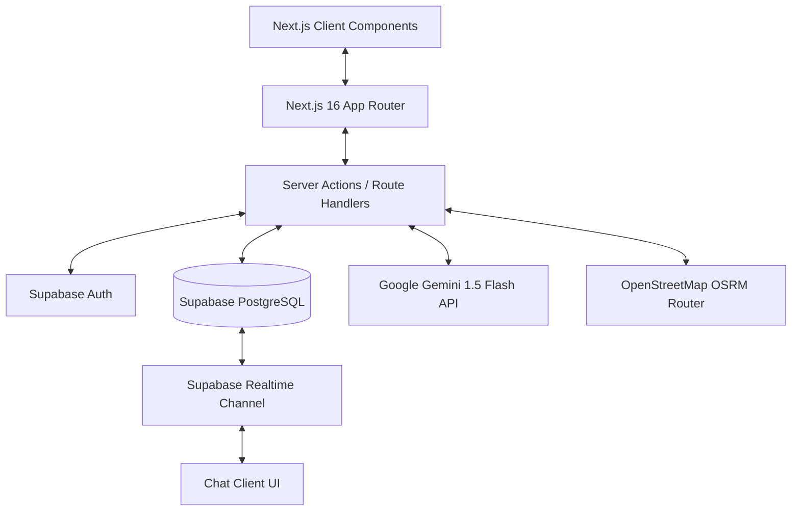

# Báo Báo Kỹ thuật Dự án — KTX Carpooling

Dịch vụ kết nối đi chung xe máy cho sinh viên Ký túc xá Đại học Quốc gia TP. Hồ Chí Minh (ĐHQG-HCM) Khu A & Khu B.

---

## 1. Giới thiệu Dự án

**KTX Carpooling** là hệ thống kết nối sinh viên ở KTX Khu A và Khu B đi học cùng tuyến đường tới các trường đại học thành viên ĐHQG-HCM (HCMUS, HCMUT, UIT, USSH, IU, UEL). 

Hệ thống giải quyết bài toán di chuyển tiết kiệm, an toàn cho sinh viên thông qua phương tiện xe máy cá nhân, tối ưu hóa chi phí xăng xe và giảm tải phương tiện giao thông nội khu Đại học Quốc gia.

---

## 2. Công nghệ & Kiến trúc Hệ thống

### 2.1 Technology Stack
- **Frontend / Fullstack Framework**: Next.js 16.3.5 (App Router), React 19.2.8.
- **Backend & Realtime Database**: Supabase (`@supabase/ssr`, `@supabase/supabase-js`).
- **Styling System**: Tailwind CSS v4 (`@tailwindcss/postcss`) kết hợp CSS Custom Properties.
- **AI Processing**: Google Gemini API (`gemini-1.5-flash`) phân tích truy vấn ngôn ngữ tự nhiên.
- **Routing & Maps**: OpenStreetMap OSRM API tính toán khoảng cách và tuyến đường xe máy thực tế.
- **Social / Messaging**: Facebook Messenger Webhook base logic.

### 2.2 Sơ đồ Kiến trúc Tổng quan


---

## 3. Các Thuật toán & Logic Nghiệp vụ Lõi

### 3.1 Thuật toán Khớp Chuyến đi (Match Score Algorithm)
Thuật toán ghép chuyến đi phối hợp **Lọc theo luật (Rule-based Filtering)** và **Chấm điểm phù hợp (Weighted Scoring)** trong [`src/lib/matching.ts`](file:///d:/CNTT/KTX%20Carpooling/ktx-carpooling/src/lib/matching.ts):

#### Bước 1: Lọc chuyến đi khả thi (Filter)
- Cùng ngày di chuyển (`date`).
- Chênh lệch giờ đón không quá 5 phút (`|t_driver - t_passenger| <= 5 min`).
- Chuyến đi ở trạng thái `OPEN` và còn ghế trống (`available_seats > 0`).
- Cùng trường đại học đích (`destination_university`).

#### Bước 2: Công thức tính Match Score (Max 100 điểm)
- **Cùng trường đại học (`school_score`)**: +40 điểm.
- **Cùng cơ sở / campus (`campus_score`)**: +25 điểm.
- **Độ chính xác về thời gian (`time_score`)**:
  - Chênh lệch 0 phút: +25 điểm.
  - Chênh lệch 1-2 phút: +20 điểm.
  - Chênh lệch 3-5 phút: +10 điểm.
- **Độ uy tín tài xế (`reputation_score`)**: Rating >= 4.5 được +10 điểm.

---

### 3.2 Thuật toán Định giá & Khoảng cách (Pricing & Distance)
Được triển khai tại [`src/lib/pricing.ts`](file:///d:/CNTT/KTX%20Carpooling/ktx-carpooling/src/lib/pricing.ts):

1. **Tính khoảng cách xe máy thực tế**:
   - Gửi request đến OSRM API: `https://router.project-osrm.org/route/v1/driving/{lng1},{lat1};{lng2},{lat2}`.
   - Khi không có kết quả hoặc API lỗi: Sử dụng ma trận khoảng cách tĩnh chuẩn hóa giữa Khu A / Khu B đến các CS trường.
2. **Công thức gợi ý chi phí chia sẻ**:
   $$\text{Giá gợi ý} = \max(\text{Distance (km)} \times 2.000\text{ VNĐ}, 5.000\text{ VNĐ})$$

---

### 3.3 Tìm kiếm Ngôn ngữ Tự nhiên bằng AI (Gemini Natural Language Parsing)
Triển khai tại [`src/lib/ai.ts`](file:///d:/CNTT/KTX%20Carpooling/ktx-carpooling/src/lib/ai.ts):
- Chuyển đổi câu nhập của sinh viên (Ví dụ: *"Mai mình học tiết 1 ở HCMUS, tìm giúp chuyến đón ở B2 khoảng 6 rưỡi"*) thành dữ liệu JSON cấu trúc:
  ```json
  {
    "date": "2026-09-21",
    "pickup_building": "B2",
    "pickup_time": "06:30",
    "destination_school": "HCMUS",
    "class_period": 1
  }
  ```
- Trường hợp Gemini API hết quota hoặc không phản hồi: Tự động kích hoạt **Regex Smart Fallback Parser** dành riêng cho từ vựng sinh viên ĐHQG.
